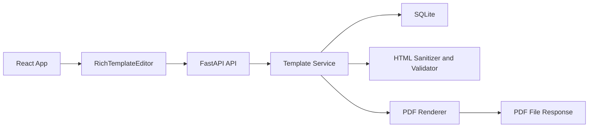
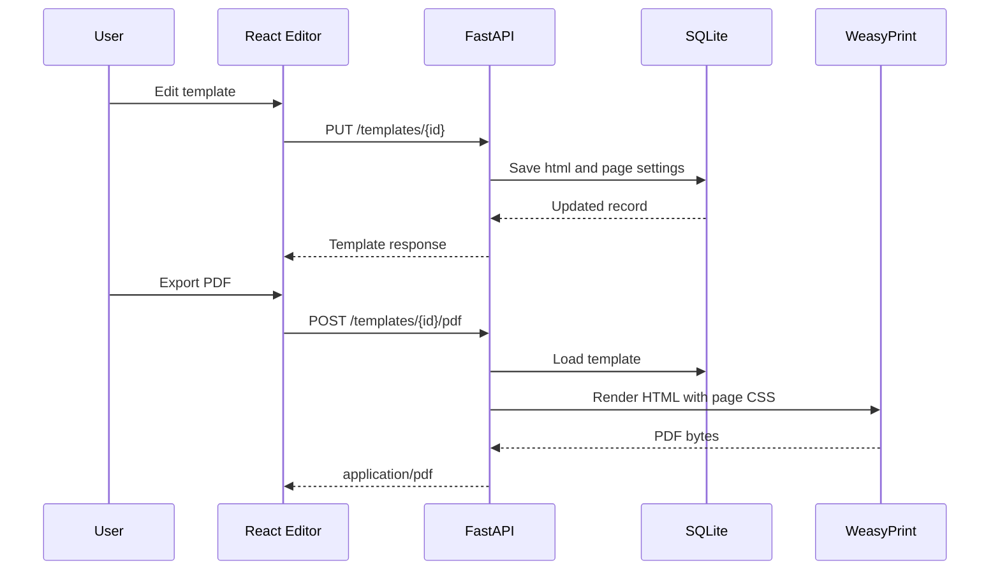

# Design: Rich Editor — Paged WYSIWYG Editor With Backend Persistence and PDF Generation

## References
- Task: ./prd.md
- Architecture: `/docs/architecture/system-overview.md` (not present in this repository)
- Standards: `/docs/architecture/standards.md` (not present in this repository)
- Related code:
  - `/Users/olegstepanyuk/Projects/playground3/package.json`
  - `/Users/olegstepanyuk/Projects/playground3/src/App.jsx`
  - `/Users/olegstepanyuk/Projects/playground3/src/main.jsx`
  - `/Users/olegstepanyuk/Projects/playground3/src/styles.css`

## Goal

Implement a reusable React paged rich editor component for HTML document templates, plus a minimal Python/FastAPI/SQLite backend with no authentication that stores templates and generates PDFs from the same canonical HTML and page settings. The design keeps HTML as the canonical content format, isolates page-aware behavior in a thin paged shell around CKEditor 5, and uses a backend PDF pipeline that honors the same page size, margins, orientation, and manual page breaks used by the editor preview.

## Non-Goals

- Building a full document management product beyond basic create, edit, save, list, and PDF export.
- Real-time collaboration, comments, suggestions, or review workflows.
- Arbitrary HTML preservation outside a supported subset.
- Role-based access control, user accounts, or multi-tenant isolation.
- A distributed job queue or async worker system for v1.
- Safari editing support in v1.

## Current Behavior

The current codebase is a minimal Vite + React application with a single placeholder screen in `/src/App.jsx`. There is no backend, no persistence layer, no PDF generation pipeline, no existing API contract, and no shared architecture documentation in the repository. The only feature-level artifact is the PRD in `specs/rich-editor/prd.md`.

## Proposed Solution (High Level)

Build the feature as two tightly aligned parts:

- A frontend `RichTemplateEditor` module that uses CKEditor 5 for editing and a React paged shell for rulers, page geometry, source mode, and page-break visualization.
- A backend FastAPI service that stores template HTML and page settings in SQLite and renders PDFs from those values using a server-side HTML-to-PDF engine.

KISS choices:

- Use CKEditor 5 instead of building editing behavior from scratch.
- Use SQLite for persistence because the scope is local/simple and there is no auth or multi-tenant scaling requirement.
- Use WeasyPrint for PDF generation because it is Python-native, supports paged media CSS, and maps well to the editor’s structural-fidelity contract without introducing a browser automation service.
- Keep PDF generation synchronous in the request path for v1. If performance becomes a problem later, the PDF service boundary can move to background jobs without changing the API contract.

## Architecture Diagram

## Data Model

SQLite tables:

- `templates`
  - `id: integer` primary key
  - `name: text` not null
  - `html: text` not null
  - `page_size: text` not null
  - `orientation: text` not null
  - `margin_top_mm: integer` not null
  - `margin_right_mm: integer` not null
  - `margin_bottom_mm: integer` not null
  - `margin_left_mm: integer` not null
  - `created_at: datetime` not null
  - `updated_at: datetime` not null

Optional v1.1 table if PDF audit/history becomes necessary:

- `template_pdf_exports`
  - Not required for v1.

Indexes:

- Index on `templates.updated_at` for list sorting.
- No other indexes are justified for v1.

Canonical content contract:

- `html` is the canonical persisted template body.
- Page settings are stored as normalized columns rather than embedded CSS blobs.
- Manual page breaks are serialized as stable markup, for example `

`.

Migration approach:

- Initial schema created by a single startup migration script or lightweight Alembic migration.
- No complex migrations are needed for v1 because there is no existing persisted data in this repository.

## API Design

Auth requirements:

- No authentication or authorization in v1.
- All endpoints are open inside the local/dev deployment context.

### `GET /templates`

- Purpose: list saved templates.
- Query params:
  - `q` optional substring filter on `name`
- Response shape:
  - array of template summaries with `id`, `name`, `pageSettings`, `updatedAt`
- Important errors:
  - `500` on database failure

### `POST /templates`

- Purpose: create a new template.
- Request body:
  - `name: string`, required, non-empty
  - `html: string`, required
  - `pageSettings`, required
    - `pageSize: "A4" | "A5"`
    - `orientation: "portrait" | "landscape"`
    - `margins.top/right/bottom/left: integer mm`, non-negative
- Validation:
  - supported HTML subset only
  - margins must fit within page bounds
- Response shape:
  - full template object with timestamps
- Important errors:
  - `400` invalid payload
  - `422` unsupported HTML subset
  - `500` database failure
- Idempotency:
  - not idempotent

### `GET /templates/{template_id}`

- Purpose: fetch one template for editing.
- Response shape:
  - `id`, `name`, `html`, `pageSettings`, `createdAt`, `updatedAt`
- Important errors:
  - `404` template not found
  - `500` database failure

### `PUT /templates/{template_id}`

- Purpose: save an existing template.
- Request body:
  - same shape as `POST /templates`, optionally including updated `name`
- Validation:
  - same as create
- Response shape:
  - updated full template object
- Important errors:
  - `400` invalid payload
  - `404` template not found
  - `422` unsupported HTML subset
  - `500` database failure
- Idempotency:
  - idempotent for identical payloads

### `DELETE /templates/{template_id}`

- Purpose: remove a template.
- Response shape:
  - `204 No Content`
- Important errors:
  - `404` template not found
  - `500` database failure
- Idempotency:
  - effectively idempotent from client perspective

### `POST /templates/{template_id}/pdf`

- Purpose: generate a PDF from the saved template.
- Request body:
  - none in v1
- Response:
  - `application/pdf` file response
- Validation:
  - template HTML must still pass backend validation
- Important errors:
  - `404` template not found
  - `422` unsupported HTML subset or invalid page settings
  - `500` PDF rendering failure
- Idempotency:
  - idempotent for unchanged saved template state

### `POST /pdf/render`

- Purpose: render an unsaved draft to PDF for preview/export.
- Request body:
  - `html: string`
  - `pageSettings`
  - optional `name: string`
- Validation:
  - same subset and page settings rules as save
- Response:
  - `application/pdf` file response
- Important errors:
  - `400` invalid payload
  - `422` unsupported HTML subset
  - `500` PDF rendering failure
- Idempotency:
  - idempotent for identical payloads

## UI/UX Design

Screens and components impacted:

- New editor shell replacing the placeholder content in `/src/App.jsx` for local integration.
- A simple template list/detail demo screen may be added to exercise create/edit/save/export flows end to end.
- Reusable editor module under `src/features/rich-editor/`.

Primary layout:

- Top toolbar for formatting, insert actions, page settings, save, and export PDF.
- Left/top rulers anchored to the current page viewport.
- Center paged workspace with visible paper, margins, and page gaps.
- Source mode as a toggle, not the default mode.

States:

- Loading: shell skeleton while editor or template fetch initializes.
- Empty: new unsaved template with a blank first page.
- Error: inline error banner for validation, save failures, fetch failures, or PDF render failures.
- Success: small save/export confirmation.

Validation rules:

- Source mode validates before returning to visual mode.
- Save/export actions validate current HTML and page settings before calling the backend.
- Unsupported markup blocks mode switch and backend save/render with a clear message.

Permissions and visibility:

- No auth gates.
- Browser support warning should be shown for Firefox best-effort mode and Safari unsupported mode.

Analytics:

- None in v1 unless introduced later by the host app.

## Component/Module Changes

Frontend:

- `src/features/rich-editor/RichTemplateEditor.jsx`
- `src/features/rich-editor/components/EditorToolbar.jsx`
- `src/features/rich-editor/components/PagedWorkspace.jsx`
- `src/features/rich-editor/components/Ruler.jsx`
- `src/features/rich-editor/components/SourceEditor.jsx`
- `src/features/rich-editor/components/PageSettingsBar.jsx`
- `src/features/rich-editor/lib/ckeditorConfig.js`
- `src/features/rich-editor/lib/htmlSubset.js`
- `src/features/rich-editor/lib/pageGeometry.js`
- `src/features/rich-editor/lib/pageBreaks.js`
- `src/features/rich-editor/lib/api.js`
- `src/features/rich-editor/styles/rich-editor.css`
- `src/App.jsx` updated to render a simple template editor screen

Backend:

- `backend/app/main.py`
- `backend/app/api/templates.py`
- `backend/app/models.py`
- `backend/app/schemas.py`
- `backend/app/db.py`
- `backend/app/services/template_service.py`
- `backend/app/services/pdf_service.py`
- `backend/app/services/html_validation.py`
- `backend/app/render/print_template.html`
- `backend/requirements.txt`

Responsibilities:

- `RichTemplateEditor.jsx`: public composition root and frontend state orchestration.
- `api.js`: fetch wrappers for template CRUD and PDF export.
- `htmlSubset.js` and backend `html_validation.py`: shared rules mirrored across frontend and backend, with backend as source of truth.
- `template_service.py`: CRUD logic and normalization between API models and SQLite.
- `pdf_service.py`: builds print CSS and renders PDF bytes from canonical HTML and page settings.
- `print_template.html`: minimal server-side wrapper that injects page CSS and sanitized body HTML.

## Backend Design

Framework choices:

- FastAPI for request handling and schema validation.
- SQLite for local persistence.
- SQLAlchemy for ORM/database access.
- Pydantic models for request/response contracts.
- WeasyPrint for server-side HTML-to-PDF conversion.

Why WeasyPrint:

- It is Python-native and keeps the backend simple.
- It supports `@page`, margins, page size, and CSS page breaks.
- It avoids running a headless browser service in v1.

PDF generation contract:

- The backend does not trust editor HTML as ready-to-print as-is.
- Before rendering, the backend wraps the sanitized body HTML in a controlled print template with:
  - `@page` size from `page_size` and `orientation`
  - margins from stored values
  - print-safe font stack shared with the editor where possible
  - CSS for explicit page breaks using `[data-page-break="true"] { break-before: page; }`
  - table and image constraints to reduce clipping

Validation approach:

- Frontend validates early for UX.
- Backend validates again before save and before PDF render.
- Unsafe tags and unsupported attributes are rejected, not silently executed.

HTML subset for v1:

- Basic text blocks: `p`, `div`, `span`, `strong`, `em`, `u`, headings
- Lists: `ul`, `ol`, `li`
- Tables: `table`, `thead`, `tbody`, `tr`, `th`, `td`
- Images: `img` with approved `src`, `alt`, width/height/style subset
- Manual page breaks: `div[data-page-break="true"]`
- No scripts, no event handlers, no iframes, no arbitrary embeds

Storage strategy:

- Store only canonical HTML and normalized page settings.
- Do not store generated PDFs in v1.
- Generate PDFs on demand and stream them back to the client.

## Key Flows

1. Create template flow
   User opens the editor screen in create mode.
   The frontend initializes a blank template with default page settings.
   User edits content and clicks save.
   Frontend sends `POST /templates`.
   Backend validates HTML and page settings, writes the row to SQLite, and returns the created template.

2. Edit existing template flow
   User selects a template from the list.
   Frontend loads `GET /templates/{id}` and initializes the editor.
   User edits content or page settings.
   Frontend sends `PUT /templates/{id}` on save.
   Backend validates and updates the stored row.

3. Export saved template to PDF flow
   User clicks export PDF.
   Frontend calls `POST /templates/{id}/pdf`.
   Backend loads the saved template, validates again, wraps the HTML in print CSS, renders via WeasyPrint, and streams the PDF response.

4. Export unsaved draft to PDF flow
   User has unsaved changes but wants a PDF preview/export.
   Frontend sends the current draft to `POST /pdf/render`.
   Backend validates the draft payload and generates a PDF without writing to SQLite.

5. Source mode round-trip flow
   User switches from visual mode to source mode.
   Frontend serializes canonical HTML into the source editor.
   User edits HTML and switches back or saves.
   Frontend validates first, backend validates again on save/render, and invalid markup is rejected with a concrete error.

## Edge Cases

- Content reflows to more or fewer pages after margin, size, or orientation changes; the editor and PDF output should both reflect the new flow.
- Large tables may move to the next page or split imperfectly depending on CSS constraints; v1 prioritizes structural fidelity over pixel-perfect table pagination.
- Large images are constrained to page content width to reduce clipping in PDF output.
- A manual page break next to natural overflow still forces a break at the explicit marker.
- Unsupported HTML pasted into source mode blocks save and PDF export until corrected.
- SQLite file locking may appear under concurrent writes; acceptable for v1 because the system has no auth and local/simple scope.
- WeasyPrint may render some complex CSS differently from Chromium-based editing preview; shared print CSS and subset restrictions are the mitigation.

## Security & Privacy

- No authentication by explicit scope choice.
- Because there is no auth, the backend must be treated as local/dev or otherwise protected at deployment level outside the app.
- Sanitize and validate all incoming HTML before storage and rendering.
- Reject scripts, event-handler attributes, unsupported URLs, and embedded active content.
- Do not fetch arbitrary remote assets during PDF rendering by default. Prefer data URLs, uploaded local assets, or a controlled asset host.
- No PII-specific handling is required in v1.

## Observability (minimal)

- Log template create/update/delete operations with template id and name.
- Log validation failures with a short machine-readable reason.
- Log PDF generation failures with template id when applicable.
- Log render duration for PDF requests.
- No metrics stack is required in v1.

## Backward Compatibility & Rollout

- There is no existing backend in this repository, so this is an additive rollout.
- Start with local development and manual validation in Chrome/Edge.
- Document Firefox as best effort for editing.
- Safari editing remains unsupported.
- If PDF rendering fidelity is insufficient for a specific document pattern, tighten the supported HTML subset before adding more infrastructure.

## Risks & Tradeoffs

- CKEditor 5 plus a custom paged shell is not a full document layout engine, so fidelity depends on disciplined HTML/CSS constraints.
- WeasyPrint may not match Chromium preview perfectly for all edge cases. This is acceptable in v1 if page size, margins, page breaks, and overall flow remain aligned.
- SQLite limits concurrent write throughput, but that is consistent with the no-auth, simple-scope backend.
- Synchronous PDF rendering keeps the architecture simple but may be slow for very large templates. This is intentionally not optimized in v1.
- Not storing generated PDFs avoids file lifecycle complexity, at the cost of regenerating on each export.
- If CKEditor becomes the limiting factor, keep the editor API stable and swap only the internal editor adapter later.

## Open Questions

- None. The backend stack, persistence scope, no-auth policy, and PDF generation approach are now defined.
